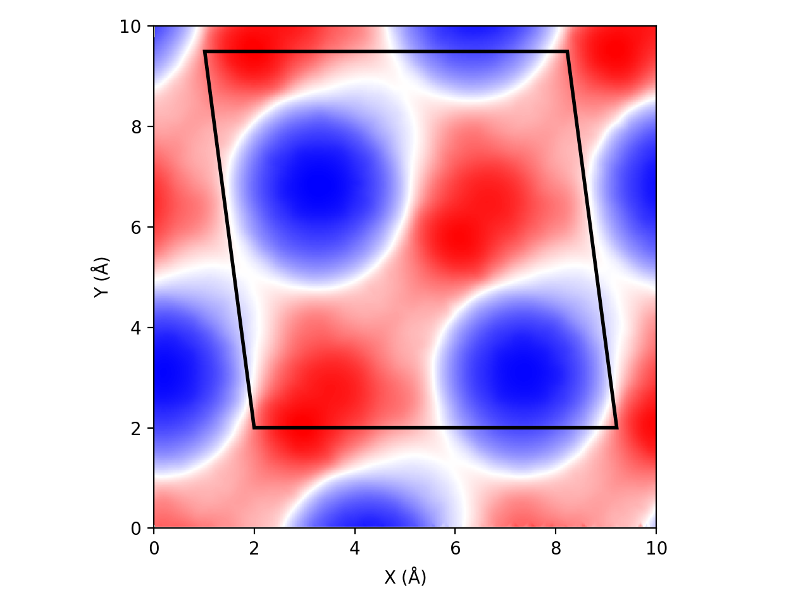
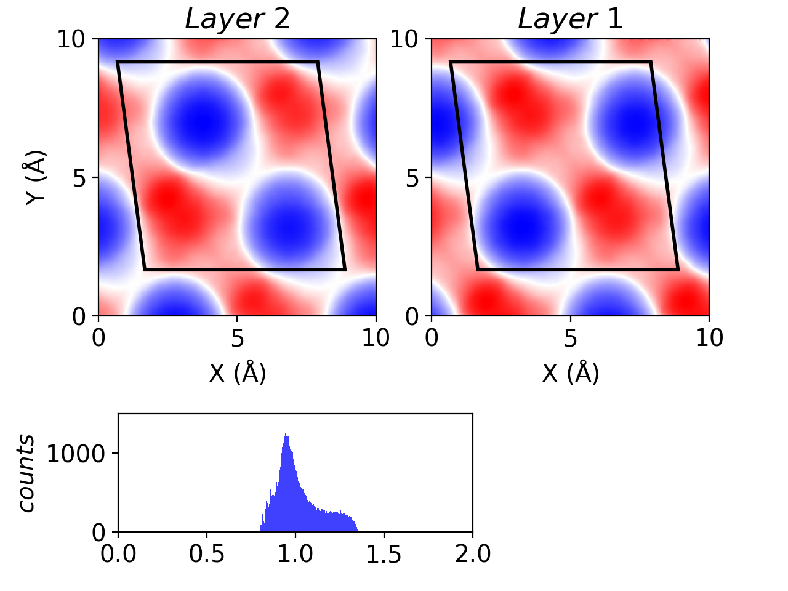

# Wavemap

This is used for describing the relative undulation of 
molecular surfaces generated for a slab model.
This has been used to produce figures in
[`Chem. Mater. 2019, 31, 17, 6900–6907`](https://pubs.acs.org/doi/abs/10.1021/acs.chemmater.9b01317)

You need `jmol`, `matplotlib`,
`numpy` and `scipy`.

## Example Results
1.`python wmap1.py bot_2.07_10x10.pmesh bot`

Look from the top (+ end of c axis) of a single surface, 
red means it is close to you. The values used for colormap is the normalized
undulation Z, which is defined by the fractional coordinates along stacking 
direction.


2.`python wmap2.py top_2.07_10x10.pmesh bot_2.07_10x10.pmesh`

This will also print the mean and sigma of all Z1+Z2 within a unitcell.
Notice you need to consider the implied symmetry for a slab-stacking situation.


## Workflow

- Load structure file in jmol. 
It's better to work on an unwrapped structure. 
To save time one can work on only specific portions of the structure, 
save it as *iso.cif*. Default is to use *c* coordinates for calculating Z.

- Generate the isosurface. Here we use the [solvent-accessible surface](http://jmol.sourceforge.net/docs/surface/). 
    - `isosurface resolution 3.0 solvent 2.0  # large solvent value --> smeared surface`

- Now cut the surface with `boundbox` and `slab`. 
Make sure you use the same boundbox (you can translate that) for both top and bot.

    - ```
      boundbox corners {0.0 0.0 12.0} {10.0 10.0 16.0}
      isosurface slab boundbox
      ```

- Then save the isosurface to something readable. It's always good to save a fig of the 3d surface for verification purpose.

    - ```
      write isosurface top.pmesh
      write JMOL iso.jmol
      write IMAGE 3dref.png
      ```
- To get a single map, simply run:
    ```
    python wmap1.py <pmesh_file> <loc>
    ```
- if you want an analysis of two surfaces:
    ```
    python wmap2.py <pmesh_file_top> <pmesh_file_bot>  # remember we define top and bot based on c axis
    ```
        


